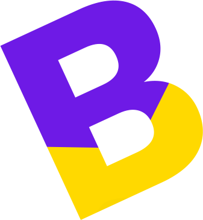
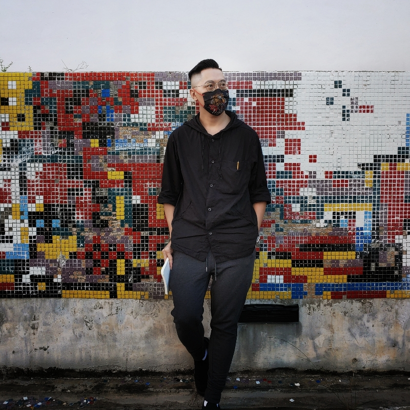

<!doctype html>
<html class="no-js" lang="zxx">

<head>
	<meta charset="utf-8">
	<meta http-equiv="x-ua-compatible" content="ie=edge">
	<title>Dennis - Hong Kong Based Colorist</title>
	<meta name="description" content="">
	<meta name="viewport" content="width=device-width, initial-scale=1">

	<!-- Favicons -->
	<link rel="shortcut icon" href="images/favicon.ico">
	<link rel="apple-touch-icon" href="images/icon.png">

	<!-- Google font (font-family: 'Open Sans', sans-serif;) -->
	<link href="https://fonts.googleapis.com/css?family=Open+Sans:400,600,700" rel="stylesheet">
	<!-- Google font (font-family: 'Poppins', sans-serif;) -->
	<link href="https://fonts.googleapis.com/css?family=Poppins:300,300i,400,400i,500,600,700,900" rel="stylesheet">

	<!-- Stylesheets -->
	<link rel="stylesheet" href="css/bootstrap.min.css">
	<link rel="stylesheet" href="css/plugins.css">
	<link rel="stylesheet" href="style.css">
	<link rel="stylesheet" href="css/dark-version.css">

	<!-- Cusom css -->
	<link rel="stylesheet" href="css/custom.css">

	<!-- Modernizer js -->
	
</head>

<body>
	 
		 
	 

	<!-- Add your site or application content here -->

	

	<!-- Main wrapper -->
	

		<!-- Homepage -->
		

			<!-- Header -->
			<header class="header-area header-style-3">
				

					
				

				<button class="fsmenu-trigger fullscreen-menu-trigger">
					<i class="ti-menu-alt"></i>
				</button>
			</header>
			<!--// Header -->

			<!-- Image Menu -->
			

				<!-- Single Menu -->
				<a href="#" data-hashlink-trigger="about-me-area" class="imgmenu2 imgmenu2-about-trigger">
					

						<h4>01. About Me</h4>
						<h6>A little introduction about me</h6>
					

					

						
					

				</a>
				<!--// Single Menu -->

				<!-- Single Menu -->
				<a href="#" data-hashlink-trigger="portfolios-area" class="imgmenu2 imgmenu2-work-trigger">
					

						<h4>02. Work</h4>
						<h6>Some of my recent works</h6>
					

					

						
					

				</a>
				<!--// Single Menu -->

				<!-- Single Menu -->
				<a href="#" data-hashlink-trigger="blogs-area" class="imgmenu2 imgmenu2-blog-trigger">
					

						<h4>03. Blank</h4>
						<h6>Empty page to reflect life</h6>
					

					

						
					

				</a>
				<!--// Single Menu -->

				<!-- Single Menu -->
				<a href="#" data-hashlink-trigger="contact-area" class="imgmenu2 imgmenu2-contact-trigger">
					

						<h4>04. Contact Me</h4>
						<h6>Want to hire? Contact me here.</h6>
					

					

						
					

				</a>
				<!--// Single Menu -->

			

			<!--// Image Menu -->

			<!-- Fullscreen Header -->
			

					
				<!-- Header -->
				<header class="header-area header-style-2 header-transparent">
					

						
					

					<button class="back-to-root-button">GO BACK TO HOME<i class="ti-close"></i></button>
				</header>
				<!--// Header -->

				<nav class="fsmenu">
					<ul>
						<li><a class="back-to-root-button" href="#">Home</a></li>
						<li><a href="#" data-hashlink-trigger="about-me-area">About</a></li>
						<li><a href="#" data-hashlink-trigger="portfolios-area">Work</a></li>
						<li><a href="#" data-hashlink-trigger="blogs-area">Blog</a></li>
						<li><a href="#" data-hashlink-trigger="contact-area">Contact</a></li>
					</ul>
				</nav>

			

			<!--// Fullscreen Header -->

		

		<!--// Homepage -->

		<!-- About Me Area -->
		

			<!-- Header -->
			<header class="header-area header-style-2 header-transparent">
				

					
				

				<button class="back-to-root-button">GO BACK TO HOME<i class="ti-close"></i></button>
			</header>
			<!--// Header -->

			

				

					
				

				

				

					<!-- About Me About -->
					

						<h4>ABOUT ME</h4>
						<h2>Hi, I'm Dennis</h2>
						
I am a colorist, video technician, DCP Mastering Technician
						Working in film post production for more than a decade now, I have dealt with many different situations and 
						have learnt to adapt in this ever changing industry. Currently a member at Best & Original Limited in Hong Kong.
						  Here's <a href="https://hk.linkedin.com/in/dennis-cheng-a58a94224">my linkedin page</a>.
						

					

					<!--// About Me About -->

					<!-- About Me Mission -->
					

						<h4>Skills</h4>
						<h2>Wide Range of Post Production Skills</h2>
						
-SDR/HDR(Dolby Vision) Color Grading -DCP Repacking / Authoring with subtitling & KDM encryption
						 -Format Conversion (SDR to HDR / Dolby Vision upscaling, De-interlacing, (Artificial Intelligence) Up/Down Scaling, Pan and Scan)
						 -Strong understandings of Dolby Vision for Home, HDR10, codecs, post production, color grading / color science knowledge
						 -Workflow Consultance -Color Grading Tutoring

						
For more information and quotation, please contact me via coloristhk@gmail.com or <a href="https://hk.linkedin.com/in/dennis-cheng-a58a94224"> linkedin (https://hk.linkedin.com/in/dennis-cheng-a58a94224)</a>.
					

					<!--// About Me Mission -->

					<!-- About Me Vision -->
					

						<h4>VISION</h4>
						<h2>Every Frame is a Painting</h2>
						
I believe color itself can be a strong story telling device. I do not shy away from using extreme color if necessary.
						My main influences came from my love for oil painting and cinema, and very often it came from life itself.
						I like to think that every frame is a painting, every frame is organic and breathing. And I like to bring back the analogue beauty in film.

						
I always tackle an image as a hold, without making too many masks which make the image artificial. I tend to see things a bit different from
						the average colorist. Always listening from different people, ranging from cinematographers, directors and even AV enthusiasts, always adapting to the industry's trend.

					

					<!--// About Me Vision -->

				

			

		

		<!--// About Me Area -->

		<!-- Portfolios Area -->
		

			<!-- Header -->
			<header class="header-area header-style-2">
				

					
				

				<button class="back-to-root-button">GO BACK TO HOME<i class="ti-close"></i></button>
			</header>
			<!--// Header -->
			
			<!-- Portfolios -->
			

				

					<!-- Single Portfolio -->
					

						

							

								

  <iframe width="560" height="315" src="https://www.youtube.com/embed/videoseries?list=PL-UiBYO7-0yPQyPcIoNAqg8rJoRMejiYD" frameborder="0" allow="accelerometer; autoplay; encrypted-media; gyroscope; picture-in-picture" allowfullscreen></iframe>

							

							

								

									<h2><a href="https://www.youtube.com/watch?v=hYPN7TboUsU&list=PL-UiBYO7-0yPQyPcIoNAqg8rJoRMejiYD">Films</a></h2>
								

							

						

					

					<!--// Single Portfolio -->

					<!-- Single Portfolio -->
					

						

							

								

									<h2><a href="https://www.youtube.com/watch?v=3V9dUTjXvKc&list=PL-UiBYO7-0yP1oLlBdygczJlPBpR38FSe">Shorts Films</a></h2>
								

							

							

								

  <iframe width="560" height="315" src="https://www.youtube.com/embed/videoseries?list=PL-UiBYO7-0yP1oLlBdygczJlPBpR38FSe" frameborder="0" allow="accelerometer; autoplay; encrypted-media; gyroscope; picture-in-picture" allowfullscreen></iframe>

							

						

					

					<!--// Single Portfolio -->
					
					<!-- Single Portfolio -->
					

						

							

								

  <iframe width="560" height="315" src="https://www.youtube.com/embed/videoseries?list=PL-UiBYO7-0yN1RwHWcjCs23Ijv_ahHj1e" frameborder="0" allow="accelerometer; autoplay; encrypted-media; gyroscope; picture-in-picture" allowfullscreen></iframe>

							

							

								

									<h2><a href="https://www.youtube.com/watch?v=F0aMBkBliOg&list=PL-UiBYO7-0yN1RwHWcjCs23Ijv_ahHj1e">TV Spots</a></h2>
								

							

						

					

					<!--// Single Portfolio -->
					
					<!-- Single Portfolio -->
					

						

							

								

									<h2>Notable Works</h2>
								

							

							

						
<h3>Shorts & Films</h3>
						  2022
						 願望扭蛋機, dir: Leung Hung Wah
						 How I Blew It, dir: Charlène Marrié
						 春去人來, dir: 馬悅朝
						  2021
						 黑水界, dir: Leung Hung Wah
						  2020
						 <a href="https://www.youtube.com/watch?v=iGE52pUMA9Q">夢追岸上人(Short), dir Samuel Pang</a>
						 操控, dir Leung Hung Wah
						 <a href="https://youtu.be/3V9dUTjXvKc">老童(Short)</a>
						 <a href="https://youtu.be/T7ftnQFw_9w">一滴可樂(Short)</a>
						 <a href="https://youtu.be/W5WRTpXd7xg">不遲(Short)</a>
						  2019
						 <a href="https://www.youtube.com/watch?v=f-pC1XPR5TU">JULUNGOA (A Scarecrow)(Short), dir: Rajesh Prasad KHATRI</a>
						 <a href="https://www.youtube.com/watch?v=uMGkY76slPA">入鐵籠 We Are Legends, dir: Daniel Chan</a>
						 <a href="https://www.youtube.com/watch?v=hYPN7TboUsU">The Cube Phantom, dir: Alan Chan</a>
						  2018
						 <a href="https://www.youtube.com/watch?v=3Ba_009_fGw">舞可能 Impossible Is Possible, dir: 梁嘉恩</a>
						 <a href="https://www.youtube.com/watch?v=wpWiEyCnyEg">梧桐(Short)</a>
						 <a href="https://www.youtube.com/watch?v=PsU5_T6y18w">第八區(Short)</a>
						 <a href="https://www.youtube.com/watch?v=KhIwwUuD990">大派對(Short)</a>
						 <a href="https://www.youtube.com/watch?v=FnWzxfGHAGE">癮誘(Short)</a>
						 <a href="https://www.youtube.com/watch?v=YXVY3GeGa7M">越界 Synesthete, dir: Leung Hung Wah</a>
						  2017
						 <a href="https://www.youtube.com/watch?v=kdb1chbnwwc">同囚 With Prisoners, dir: Andrew Wong</a>  
						
<h3>Television Shows</h3>
						 <a href="https://www.youtube.com/watch?v=sTJ7ZuirPR4&list=PLna3ZYPCf2wDrxkfN9QdBFGqE3iZS7eyU">《聽＼說 II》系列</a>
						 <a href="https://www.youtube.com/playlist?list=PLuwJy35eAVaLucth4WLT553YCOX1ndR2_">格外樓神
						 <a href="https://www.youtube.com/playlist?list=PLuwJy35eAVaKYvnhhpmL2wtztGgMp5iJw">我煮場 Cooking Family
						 <a href="https://www.youtube.com/playlist?list=PLuwJy35eAVaJRo_Hn0N3UqKxwvZ12lQp_">陪我講 Shall We Talk
						 <a href="https://www.youtube.com/playlist?list=PLuwJy35eAVaLBV9rjLonYVriZVgu3PHiN">大自然大不同 (Biodiversity in Hong Kong)
						 <a href="https://www.youtube.com/watch?v=1I257sKKP3U">獅子山下 2020 - 鶼鰈</a>
						 <a href="https://www.youtube.com/watch?v=zlbpvYYxilI&list=PLuwJy35eAVaLmNYf5bfn-iRNQmyUmQSm_">獅子山下 2018 - 苦樂園, 拾海星的人</a>
						 <a href="https://www.youtube.com/watch?v=Ve7zUD6egwY">獅子山下 2017 - 秘密, 斷線</a>
						 <a href="https://www.youtube.com/watch?v=PO3yoVk6P-c&list=PLuwJy35eAVaK6n8NHaCMlYSEoQFlKb0fs">沒有牆的世界 6</a>
						 <a href="https://www.youtube.com/watch?v=GMZjIX7EnP4&list=PLuwJy35eAVaL5bt7ZFVHCkzsC4E_OvZpc">星星的孩子</a>
						 <a href="https://www.youtube.com/watch?v=g1YtJoTqKEs&list=PLuwJy35eAVaKTN8TVFKDv2a7htooQqffl">火速救兵 IV</a>
						 <a href="https://www.youtube.com/watch?v=JNgbH6OWjFs&list=PLuwJy35eAVaIxrkQz0mz_tz3er2hKNciC">迷什麼 - 熨斗, 再見王子, 不捨不棄, Sigmund Freud 說是一種創傷</a>
						 <a href="https://www.youtube.com/watch?v=adqOkntwrvw&list=PLuwJy35eAVaKJzxrTpaNRz4K_muOoFmAI">歲月不忘情 - 花團錦簇, 紳士老爺, 過路人, 車廂中的時間總過得比較慢, 只有香如故</a>
						 <a href="https://www.youtube.com/watch?v=I4EuaV60wr4&list=PLuwJy35eAVaIXvX8azmanA3DYRAMVoQsI">手語隨想曲6</a>
						 <a href="https://www.youtube.com/watch?v=MbYAxFCWaZw&list=PLuwJy35eAVaKtnV8lfAnYWyIwlPi5plhY">忘憂理髮店</a>

							

						

					

					<!--// Single Portfolio -->						

					

						<a href="#" class="cr-btn cr-btn-icon portfolio-load-more">
							
							Load More
						</a>
					

				

			

			<!--// Portfolios -->

		

		<!--// Portfolios Area -->

		<!-- Blogs Area -->
		

            

			<!-- Header -->
			<header class="header-area header-style-2">
				

					
				

				<button class="back-to-root-button">GO BACK TO HOME<i class="ti-close"></i></button>
			</header>
			<!--// Header -->

			<!-- Blogs Inner -->
			

				<!-- Blogs Wrapper -->
				

					

						

						

					
	
				

				<!--// Blogs Wrapper -->

			

            <!--// Blogs Inner -->
            
            

		

		<!--// Blogs Area -->

		<!-- Contact Area -->
		

			<!-- Header -->
			<header class="header-area header-style-2">
				

					
				

				<button class="back-to-root-button">GO BACK TO HOME<i class="ti-close"></i></button>
			</header>
			<!--// Header -->

			<!-- Breadcrumb -->
			

				

					

						

							

								<h1>Contact Now!</h1>
							

						

					

				

			

			<!--// Breadcrumb -->

			<!-- Contact Area Inner -->
			

				

					
						
						

						

								

									
										
									
									

										<h6>Linkedin</h6>
										
<a href="https://hk.linkedin.com/in/dennis-cheng-a58a94224">Dennis Cheng </a>

									

								

							

							

								

									
										
									
									

										<h6>Tel/Whatsapp/TG</h6>
										
+(852) - 70714656

										
<a href="https://t.me/coloristhk">TG: @coloristhk</a>

									

								

							

							

								

									
										
									
									

										<h6>E-mail</h6>
										
<a href="mailto://coloristhk@gmail.com">coloristhk@gmail.com</a>

									

								

							

						

					

					

						

							

								 
© 2020 <a href="#">powergra.de</a>. All Rights Reserved.

							

						

					

						
				

			

			<!--// Contact Area Inner -->
		

		<!--// Contact Area -->

	

	<!-- //Main wrapper -->
	<!-- JS Files -->
	
	
	
	
	
	
	
	

</body>

</html>